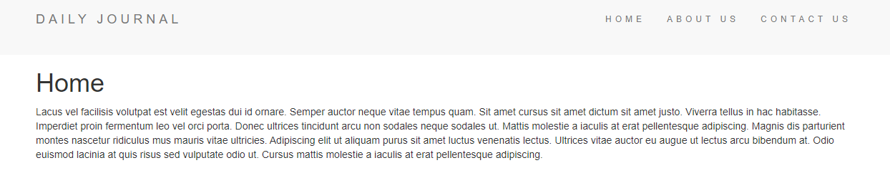

<h1 align="center">Blog Website</h1>
  
Project for mastering partials.

 
 

## What is this project about?
This project is in progress. This is a minimalistic personal blog/diary website. It has a header with a navigation bar. On the bottom there is a sticky footer. The home page is going to have all of blog posts listed in chronological order but the actual blog content is truncated to 100 characters. After clicking on read, you will be taken to an individual page of each of the blog posts.

## Technologies used
- HTML
- JavaScript
- GIT
- EJS
- Node.js
- Express.js
- Lodash
 

## What have I learned?
- Lodash library (_.lowerCase method),
- forEach method,
- express routing parameters,
- mastering EJS templates.
 
 

*project is based on [Web Development Course](https://www.udemy.com/course/the-complete-web-development-bootcamp/)

